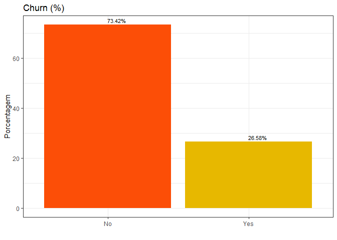

  
  
  
  <!-- highlight: tango pygments kate monochrome zenburn haddock textmate -->
  <!-- theme: cerulean, journal, flatly, readable, spacelab, united, cosmo, lumen, paper, sandston, simplex, yeti -->
  
  <!----------  INÍCIO CONFIG  ---------->
  


  
## Introdução
  
  Essa análise tem como principal foco verificar padrões e coomportamentos em clientes de telecomunicações que possuem maior propenção a deixar de ser cliente da empresa (sair da base / migração de clientes). Através de análise exploratória de dados incia-se um processo de descoberta dos dados e possíveis variáveis que viabilizam o reconhecimento de padrões de clientes de telco e, posteriormente, o uso de técnicas de análise preditiva para determinar os clientes que com maior probabilidade irão migrar.

||
|:---:|
-------------------------------------
  
  
## Banco de Dados

### Descrição
  
  O conjunto de dados utilizado foi o de título *Telco Customer Churn* extraído da plataforma [kaggle](https://www.kaggle.com/). As informações contidas no banco são do programa de retenção de 7044 clientes de telecomunicações contendo 21 variáveis descritas a seguir:
  
- Se deixou de ser cliente
- Serviços aderidos por cada cada cliente mobile  
    + qtd. de linhas  
    + internet  
    + segurança online  
    + backup online  
    + seguro  
    + suporte técnico  
    + TV a cabo  

- Informações da conta do cliente   
    +  Tempo da conta  
    +  Contrato  
    +  Método de pagamento  
    +  Conta online (sem impressão)  
    +  Encargos mensais  
    +  Total da conta  

- Informações Demográficas do cliente  
    + Gênero  
    + Faixa etária  
    + Possui parceiros ou dependentes  

*Os dados em questão são públicos e disponíveis para download clicando [AQUI](https://www.kaggle.com/blastchar/telco-customer-churn/home).* 

### Pacotes

```r
library(tidyverse)
library(highcharter)
library(cowplot)
```

  
### Leitura

```r
telco = read.csv2("WA_Fn-UseC_-Telco-Customer-Churn.csv", sep = ";", header = TRUE, na.strings = "")
#class(db)
```

### Estrutura

7.043 observações e 21 variáveis.


```r
glimpse(telco) #str(db)
```

```
## Observations: 7,043
## Variables: 21
## $ customerID       <fct> 7590-VHVEG, 5575-GNVDE, 3668-QPYBK, 7795-CFOC...
## $ gender           <fct> Female, Male, Male, Male, Female, Female, Mal...
## $ SeniorCitizen    <int> 0, 0, 0, 0, 0, 0, 0, 0, 0, 0, 0, 0, 0, 0, 0, ...
## $ Partner          <fct> Yes, No, No, No, No, No, No, No, Yes, No, Yes...
## $ Dependents       <fct> No, No, No, No, No, No, Yes, No, No, Yes, Yes...
## $ tenure           <dbl> 1, 34, 2, 45, 2, 8, 22, 10, 28, 62, 13, 16, 5...
## $ PhoneService     <fct> No, Yes, Yes, No, Yes, Yes, Yes, No, Yes, Yes...
## $ MultipleLines    <fct> No phone service, No, No, No phone service, N...
## $ InternetService  <fct> DSL, DSL, DSL, DSL, Fiber optic, Fiber optic,...
## $ OnlineSecurity   <fct> No, Yes, Yes, Yes, No, No, No, Yes, No, Yes, ...
## $ OnlineBackup     <fct> Yes, No, Yes, No, No, No, Yes, No, No, Yes, N...
## $ DeviceProtection <fct> No, Yes, No, Yes, No, Yes, No, No, Yes, No, N...
## $ TechSupport      <fct> No, No, No, Yes, No, No, No, No, Yes, No, No,...
## $ StreamingTV      <fct> No, No, No, No, No, Yes, Yes, No, Yes, No, No...
## $ StreamingMovies  <fct> No, No, No, No, No, Yes, No, No, Yes, No, No,...
## $ Contract         <fct> Month-to-month, One year, Month-to-month, One...
## $ PaperlessBilling <fct> Yes, No, Yes, No, Yes, Yes, Yes, No, Yes, No,...
## $ PaymentMethod    <fct> Electronic check, Mailed check, Mailed check,...
## $ MonthlyCharges   <dbl> 29.85, 56.95, 53.85, 42.30, 70.70, 99.65, 89....
## $ TotalCharges     <dbl> 29.85, 1889.50, 108.15, 1840.75, 151.65, 820....
## $ Churn            <fct> No, No, Yes, No, Yes, Yes, No, No, Yes, No, N...
```

Porcentagem de NA por variável


```r
options(repr.plot.width = 6, repr.plot.height = 4)
missing_data <- telco %>% summarise_all(funs(sum(is.na(.))/n()))
missing_data <- gather(missing_data, key = "variables", value = "percent_missing")
ggplot(missing_data, aes(x = reorder(variables, percent_missing), y = percent_missing)) +
geom_bar(stat = "identity", fill = "red", aes(color = I('white')), size = 0.3)+
xlab('Variáveis')+
ylab('Porcentagem de valores faltantes (NA)') +
coord_flip()+ 
theme_bw()
```

<!-- -->


```r
cat("Existem", sum(is.na(telco$TotalCharges)), "observações faltantes na variável 'TotalCharges'")
```

```
## Existem 11 observações faltantes na variável 'TotalCharges'
```

Entretanto, esses valores faltantes apenas ocorrem quando a variável 'tenure' assume valor zero e consequentemente na variável 'MonthlyCharges' existem valores (diferente de zero). Ou seja, 'TotalCharges' apenas possui valores para meses (tenure) maiores ou iguais a um de permanência do cliente. 


```r
telco[is.na(telco$TotalCharges), c(1, 6, 19, 20)]
```

<div data-pagedtable="false">
  <script data-pagedtable-source type="application/json">
{"columns":[{"label":[""],"name":["_rn_"],"type":[""],"align":["left"]},{"label":["customerID"],"name":[1],"type":["fctr"],"align":["left"]},{"label":["tenure"],"name":[2],"type":["dbl"],"align":["right"]},{"label":["MonthlyCharges"],"name":[3],"type":["dbl"],"align":["right"]},{"label":["TotalCharges"],"name":[4],"type":["dbl"],"align":["right"]}],"data":[{"1":"4472-LVYGI","2":"0","3":"52.55","4":"NA","_rn_":"489"},{"1":"3115-CZMZD","2":"0","3":"20.25","4":"NA","_rn_":"754"},{"1":"5709-LVOEQ","2":"0","3":"80.85","4":"NA","_rn_":"937"},{"1":"4367-NUYAO","2":"0","3":"25.75","4":"NA","_rn_":"1083"},{"1":"1371-DWPAZ","2":"0","3":"56.05","4":"NA","_rn_":"1341"},{"1":"7644-OMVMY","2":"0","3":"19.85","4":"NA","_rn_":"3332"},{"1":"3213-VVOLG","2":"0","3":"25.35","4":"NA","_rn_":"3827"},{"1":"2520-SGTTA","2":"0","3":"20.00","4":"NA","_rn_":"4381"},{"1":"2923-ARZLG","2":"0","3":"19.70","4":"NA","_rn_":"5219"},{"1":"4075-WKNIU","2":"0","3":"73.35","4":"NA","_rn_":"6671"},{"1":"2775-SEFEE","2":"0","3":"61.90","4":"NA","_rn_":"6755"}],"options":{"columns":{"min":{},"max":[10]},"rows":{"min":[10],"max":[10]},"pages":{}}}
  </script>
</div>

Optamos por remover essas observações do banco de dados uma vez que esses clientes não ficaram tempo suficiente (menos de um Mês) para avaliações e análises preditivas posteriores.


```r
telco <- telco[!is.na(telco$TotalCharges),]
telco[is.na(telco$TotalCharges), c(1, 6, 19, 20)]
```

<div data-pagedtable="false">
  <script data-pagedtable-source type="application/json">
{"columns":[{"label":["customerID"],"name":[1],"type":["fctr"],"align":["left"]},{"label":["tenure"],"name":[2],"type":["dbl"],"align":["right"]},{"label":["MonthlyCharges"],"name":[3],"type":["dbl"],"align":["right"]},{"label":["TotalCharges"],"name":[4],"type":["dbl"],"align":["right"]}],"data":[],"options":{"columns":{"min":{},"max":[10]},"rows":{"min":[10],"max":[10]},"pages":{}}}
  </script>
</div>


```r
cat("Portanto, o novo banco de dados possui", dim(telco)[1], "observações.")
```

```
## Portanto, o novo banco de dados possui 7032 observações.
```


<!--
Portanto, esses valores não significam necessariamente valores faltantes, esses podem apenas ser interpretados como clientes que não ficaram tempo suficiente (menos de um mês) para que fossem gerados encargos na variável 'TotalCharges'. A princípio, essas observações não serão excluídas. -->

### Preparação de dados

Existem apenas 3 variáveis contínuas no banco de dados ('Tenure', 'MonthlyCharges' e 'TotalCharges'). 'SeniorCitizen' está em formato de variável inteira (0 ou 1) e este será modificado para categórica (factor).

```r
telco <- telco[complete.cases(telco),]
telco$SeniorCitizen <- ifelse(telco$SeniorCitizen==1, 'Yes', 'No')
```
## Análise Exploratória


```r
glimpse(telco)
```

```
## Observations: 7,032
## Variables: 21
## $ customerID       <fct> 7590-VHVEG, 5575-GNVDE, 3668-QPYBK, 7795-CFOC...
## $ gender           <fct> Female, Male, Male, Male, Female, Female, Mal...
## $ SeniorCitizen    <chr> "No", "No", "No", "No", "No", "No", "No", "No...
## $ Partner          <fct> Yes, No, No, No, No, No, No, No, Yes, No, Yes...
## $ Dependents       <fct> No, No, No, No, No, No, Yes, No, No, Yes, Yes...
## $ tenure           <dbl> 1, 34, 2, 45, 2, 8, 22, 10, 28, 62, 13, 16, 5...
## $ PhoneService     <fct> No, Yes, Yes, No, Yes, Yes, Yes, No, Yes, Yes...
## $ MultipleLines    <fct> No phone service, No, No, No phone service, N...
## $ InternetService  <fct> DSL, DSL, DSL, DSL, Fiber optic, Fiber optic,...
## $ OnlineSecurity   <fct> No, Yes, Yes, Yes, No, No, No, Yes, No, Yes, ...
## $ OnlineBackup     <fct> Yes, No, Yes, No, No, No, Yes, No, No, Yes, N...
## $ DeviceProtection <fct> No, Yes, No, Yes, No, Yes, No, No, Yes, No, N...
## $ TechSupport      <fct> No, No, No, Yes, No, No, No, No, Yes, No, No,...
## $ StreamingTV      <fct> No, No, No, No, No, Yes, Yes, No, Yes, No, No...
## $ StreamingMovies  <fct> No, No, No, No, No, Yes, No, No, Yes, No, No,...
## $ Contract         <fct> Month-to-month, One year, Month-to-month, One...
## $ PaperlessBilling <fct> Yes, No, Yes, No, Yes, Yes, Yes, No, Yes, No,...
## $ PaymentMethod    <fct> Electronic check, Mailed check, Mailed check,...
## $ MonthlyCharges   <dbl> 29.85, 56.95, 53.85, 42.30, 70.70, 99.65, 89....
## $ TotalCharges     <dbl> 29.85, 1889.50, 108.15, 1840.75, 151.65, 820....
## $ Churn            <fct> No, No, Yes, No, Yes, Yes, No, No, Yes, No, N...
```

Visualizando, primeiramente, a variável categórica resposta de interesse 'Churn'. Onde `Yes` significa que o cliente migrou (deixou de ser cliente) e `No` que ele permanece como cliente.

Mais especificamente, pelo 'Churn' fica claro o quantitativo de clientes que migraram no último mes. 
Cerca de 26% dos clientes deixaram de ser atendido pelos serviços da empresa no último mes.


```r
options(repr.plot.width = 6, repr.plot.height = 4)
telco %>% 
group_by(Churn) %>% 
summarise(Count = n())%>% 
mutate(percent = prop.table(Count)*100)%>%
ggplot(aes(reorder(Churn, -percent), percent), fill = Churn)+
geom_col(fill = c("#FC4E07", "#E7B800"))+
geom_text(aes(label = sprintf("%.2f%%", percent)), hjust = 0.01,vjust = -0.5, size =3)+ 
theme_bw()+  
xlab("") + 
ylab("Porcentagem")+
ggtitle("Churn (%)")
```

<!-- -->

- Gênero - A porcentagem de churn é praticamente a mesma entre gêneros masculino e feminino.
- A porcentagem de churn é maior entre os cidadãos de terceira idade (senior citizens)
- Clientes com parceiros e dependentes têm menores taxas de Churn comparadas àquele que não tem parceiros e dependentes.

<!--

```r
options(repr.plot.width = 12, repr.plot.height = 8)
plot_grid(ggplot(telco, aes(x=gender,fill=Churn))+ geom_bar(), 
          ggplot(telco, aes(x=SeniorCitizen,fill=Churn))+ geom_bar(position = 'fill'),
          ggplot(telco, aes(x=Partner,fill=Churn))+ geom_bar(position = 'fill'),
          ggplot(telco, aes(x=Dependents,fill=Churn))+ geom_bar(position = 'fill'),
          ggplot(telco, aes(x=PhoneService,fill=Churn))+ geom_bar(position = 'fill'),
          ggplot(telco, aes(x=MultipleLines,fill=Churn))+ geom_bar(position = 'fill')+theme_bw()+
          scale_x_discrete(labels = function(x) str_wrap(x, width = 10)),
          align = "h")
```

<!-- -->
-->


```r
library(ggpubr)
```

```
## 
## Attaching package: 'ggpubr'
```

```
## The following object is masked from 'package:cowplot':
## 
##     get_legend
```

```r
p1 = ggplot(telco, aes(x=gender,fill=Churn))+ geom_bar()
p2 = ggplot(telco, aes(x=SeniorCitizen,fill=Churn))+ geom_bar(position = 'fill')
p3 = ggplot(telco, aes(x=Partner,fill=Churn))+ geom_bar(position = 'fill')
p4 = ggplot(telco, aes(x=Dependents,fill=Churn))+ geom_bar(position = 'fill')
p5 = ggplot(telco, aes(x=PhoneService,fill=Churn))+ geom_bar(position = 'fill')
p6 = ggplot(telco, aes(x=MultipleLines,fill=Churn))+ geom_bar(position = 'fill')+theme_bw()
ggarrange(p1, p2, p3, p4, p5,p6, ncol=3, nrow=3, common.legend = TRUE, legend="right")
```

<!-- -->


Churn rate is much higher in case of Fiber Optic InternetServices.
Customers who do not have services like No OnlineSecurity , OnlineBackup and TechSupport have left the platform in the past month.

<!--

```r
options(repr.plot.width = 12, repr.plot.height = 8)
plot_grid(ggplot(telco, aes(x=InternetService,fill=Churn))+ geom_bar(position = 'fill')+ 
          scale_x_discrete(labels = function(x) str_wrap(x, width = 10)), 
          ggplot(telco, aes(x=OnlineSecurity,fill=Churn))+ geom_bar(position = 'fill')+
          scale_x_discrete(labels = function(x) str_wrap(x, width = 10)),
          ggplot(telco, aes(x=OnlineBackup,fill=Churn))+ geom_bar(position = 'fill')+
          scale_x_discrete(labels = function(x) str_wrap(x, width = 10)),
          ggplot(telco, aes(x=DeviceProtection,fill=Churn))+ geom_bar(position = 'fill')+
          scale_x_discrete(labels = function(x) str_wrap(x, width = 10)),
          ggplot(telco, aes(x=TechSupport,fill=Churn))+ geom_bar(position = 'fill')+
          scale_x_discrete(labels = function(x) str_wrap(x, width = 10)),
          ggplot(telco, aes(x=StreamingTV,fill=Churn))+ geom_bar(position = 'fill')+theme_bw()+
          scale_x_discrete(labels = function(x) str_wrap(x, width = 10)),
          align = "h")
```

<!-- -->
-->


```r
p2.1 = ggplot(telco, aes(x=InternetService,fill=Churn))+ geom_bar(position = 'fill') + scale_x_discrete(labels = function(x) str_wrap(x, width = 10))
p2.2 = ggplot(telco, aes(x=OnlineSecurity,fill=Churn))+ geom_bar(position = 'fill') + scale_x_discrete(labels = function(x) str_wrap(x, width = 10))
p2.3 = ggplot(telco, aes(x=OnlineBackup,fill=Churn))+ geom_bar(position = 'fill') + scale_x_discrete(labels = function(x) str_wrap(x, width = 10))
p2.4 = ggplot(telco, aes(x=DeviceProtection,fill=Churn))+ geom_bar(position = 'fill') + scale_x_discrete(labels = function(x) str_wrap(x, width = 10))
p2.5 = ggplot(telco, aes(x=TechSupport,fill=Churn))+ geom_bar(position = 'fill') + scale_x_discrete(labels = function(x) str_wrap(x, width = 10))
p2.6 = ggplot(telco, aes(x=StreamingTV,fill=Churn))+ geom_bar(position = 'fill')+theme_bw()+scale_x_discrete(labels = function(x) str_wrap(x, width = 10))
ggarrange(p1, p2, p3, p4, p5,p6, ncol=3, nrow=3, common.legend = TRUE, legend="right")
```

<!-- -->

A larger percent of Customers with monthly subscription have left when compared to Customers with one or two year contract.
Churn percent is higher in case of cutsomers having paperless billing option.
Customers who have ElectronicCheck PaymentMethod tend to leave the platform more when compared to other options.

<!--

```r
plot_grid(ggplot(telco, aes(x=StreamingMovies,fill=Churn))+ geom_bar(position = 'fill')+ 
          scale_x_discrete(labels = function(x) str_wrap(x, width = 10)), 
          ggplot(telco, aes(x=Contract,fill=Churn))+ geom_bar(position = 'fill')+
          scale_x_discrete(labels = function(x) str_wrap(x, width = 10)),
          ggplot(telco, aes(x=PaperlessBilling,fill=Churn))+ geom_bar(position = 'fill')+
          scale_x_discrete(labels = function(x) str_wrap(x, width = 10)),
          ggplot(telco, aes(x=PaymentMethod,fill=Churn))+ geom_bar(position = 'fill')+theme_bw()+
          scale_x_discrete(labels = function(x) str_wrap(x, width = 10)),
          align = "h")
```

<!-- -->
-->


```r
p3.1 = ggplot(telco, aes(x=StreamingMovies,fill=Churn))+ geom_bar(position = 'fill')+ scale_x_discrete(labels = function(x) str_wrap(x, width = 10))
p3.2 = ggplot(telco, aes(x=Contract,fill=Churn))+ geom_bar(position = 'fill')+scale_x_discrete(labels = function(x) str_wrap(x, width = 10))
p3.3 = ggplot(telco, aes(x=PaperlessBilling,fill=Churn))+ geom_bar(position = 'fill')+scale_x_discrete(labels = function(x) str_wrap(x, width = 10))
p3.4 = ggplot(telco, aes(x=PaymentMethod,fill=Churn))+ geom_bar(position = 'fill')+theme_bw()+scale_x_discrete(labels = function(x) str_wrap(x, width = 10))
ggarrange(p1, p2, p3, p4, ncol=2, nrow=2, common.legend = TRUE, legend="right")
```

<!-- -->

Analyzing the three continuous variables w.r.t CHURN:

Tenure: The median tenure for customers who have left is around 10 months, there are few outliers though.


```r
options(repr.plot.width =6, repr.plot.height = 2)
ggplot(telco, aes(y= tenure, x = "", fill = Churn)) + 
geom_boxplot()+ 
theme_bw()+
xlab(" ")
```

<!-- -->


```r
hcboxplot(x = telco$tenure, var = telco$Churn,
          outliers = FALSE) %>% 
  hc_title(text = "Boxplot do tempo de fidelização do cliente X Desistência") %>% 
  hc_chart(type = "column") %>% # to put box vertical 
  hc_exporting(enabled = TRUE)  # enable exporting option
```

<!--html_preserve--><div id="htmlwidget-9403371604f827e7364a" style="width:100%;height:500px;" class="highchart html-widget"></div>
<script type="application/json" data-for="htmlwidget-9403371604f827e7364a">{"x":{"hc_opts":{"title":{"text":"Boxplot do tempo de fidelização do cliente X Desistência"},"yAxis":{"title":{"text":null}},"credits":{"enabled":false},"exporting":{"enabled":true},"plotOptions":{"series":{"turboThreshold":0,"marker":{"symbol":"circle"},"showInLegend":false},"treemap":{"layoutAlgorithm":"squarified"},"bubble":{"minSize":5,"maxSize":25}},"annotationsOptions":{"enabledButtons":false},"tooltip":{"delayForDisplay":10},"chart":{"type":"column"},"xAxis":{"type":"category","categories":""},"series":[{"name":null,"data":[{"name":"No","low":1,"q1":15,"median":38,"q3":61,"high":72},{"name":"Yes","low":1,"q1":2,"median":10,"q3":29,"high":69}],"type":"boxplot","id":null}]},"theme":{"chart":{"backgroundColor":"transparent"}},"conf_opts":{"global":{"Date":null,"VMLRadialGradientURL":"http =//code.highcharts.com/list(version)/gfx/vml-radial-gradient.png","canvasToolsURL":"http =//code.highcharts.com/list(version)/modules/canvas-tools.js","getTimezoneOffset":null,"timezoneOffset":0,"useUTC":true},"lang":{"contextButtonTitle":"Chart context menu","decimalPoint":".","downloadJPEG":"Download JPEG image","downloadPDF":"Download PDF document","downloadPNG":"Download PNG image","downloadSVG":"Download SVG vector image","drillUpText":"Back to {series.name}","invalidDate":null,"loading":"Loading...","months":["January","February","March","April","May","June","July","August","September","October","November","December"],"noData":"No data to display","numericSymbols":["k","M","G","T","P","E"],"printChart":"Print chart","resetZoom":"Reset zoom","resetZoomTitle":"Reset zoom level 1:1","shortMonths":["Jan","Feb","Mar","Apr","May","Jun","Jul","Aug","Sep","Oct","Nov","Dec"],"thousandsSep":" ","weekdays":["Sunday","Monday","Tuesday","Wednesday","Thursday","Friday","Saturday"]}},"type":"chart","fonts":[],"debug":false},"evals":[],"jsHooks":[]}</script><!--/html_preserve-->


MonthlyCharges: Customers who have churned, have high monthly charges. The median is above 75.


```r
ggplot(telco, aes(y= MonthlyCharges, x = "", fill = Churn)) + 
geom_boxplot()+ 
theme_bw()+
xlab(" ")
```

<!-- -->


```r
hcboxplot(x = telco$MonthlyCharges, var = telco$Churn,
          outliers = FALSE) %>% 
  hc_title(text = "Boxplot dos encargos mensais X Desistência") %>% 
  hc_chart(type = "column") %>% # to put box vertical 
  hc_exporting(enabled = TRUE)  # enable exporting option
```

<!--html_preserve--><div id="htmlwidget-eda156445bf33bd1b362" style="width:100%;height:500px;" class="highchart html-widget"></div>
<script type="application/json" data-for="htmlwidget-eda156445bf33bd1b362">{"x":{"hc_opts":{"title":{"text":"Boxplot dos encargos mensais X Desistência"},"yAxis":{"title":{"text":null}},"credits":{"enabled":false},"exporting":{"enabled":true},"plotOptions":{"series":{"turboThreshold":0,"marker":{"symbol":"circle"},"showInLegend":false},"treemap":{"layoutAlgorithm":"squarified"},"bubble":{"minSize":5,"maxSize":25}},"annotationsOptions":{"enabledButtons":false},"tooltip":{"delayForDisplay":10},"chart":{"type":"column"},"xAxis":{"type":"category","categories":""},"series":[{"name":null,"data":[{"name":"No","low":18.25,"q1":25.1,"median":64.45,"q3":88.475,"high":118.75},{"name":"Yes","low":18.85,"q1":56.15,"median":79.65,"q3":94.2,"high":118.35}],"type":"boxplot","id":null}]},"theme":{"chart":{"backgroundColor":"transparent"}},"conf_opts":{"global":{"Date":null,"VMLRadialGradientURL":"http =//code.highcharts.com/list(version)/gfx/vml-radial-gradient.png","canvasToolsURL":"http =//code.highcharts.com/list(version)/modules/canvas-tools.js","getTimezoneOffset":null,"timezoneOffset":0,"useUTC":true},"lang":{"contextButtonTitle":"Chart context menu","decimalPoint":".","downloadJPEG":"Download JPEG image","downloadPDF":"Download PDF document","downloadPNG":"Download PNG image","downloadSVG":"Download SVG vector image","drillUpText":"Back to {series.name}","invalidDate":null,"loading":"Loading...","months":["January","February","March","April","May","June","July","August","September","October","November","December"],"noData":"No data to display","numericSymbols":["k","M","G","T","P","E"],"printChart":"Print chart","resetZoom":"Reset zoom","resetZoomTitle":"Reset zoom level 1:1","shortMonths":["Jan","Feb","Mar","Apr","May","Jun","Jul","Aug","Sep","Oct","Nov","Dec"],"thousandsSep":" ","weekdays":["Sunday","Monday","Tuesday","Wednesday","Thursday","Friday","Saturday"]}},"type":"chart","fonts":[],"debug":false},"evals":[],"jsHooks":[]}</script><!--/html_preserve-->


TotalCharges:* The median Total charges of customers who have churned is low but again with few outliers.


```r
ggplot(telco, aes(y= TotalCharges, x = "", fill = Churn)) + 
geom_boxplot()+ 
theme_bw()+
xlab(" ")
```

<!-- -->


```r
hcboxplot(x = telco$TotalCharges, var = telco$Churn,
          outliers = FALSE) %>% 
  hc_title(text = "Boxplot dos encargos totais X Desistência") %>% 
  hc_chart(type = "column") %>% # to put box vertical 
  hc_exporting(enabled = TRUE)  # enable exporting option
```

<!--html_preserve--><div id="htmlwidget-5f1e719239664e7bb62a" style="width:100%;height:500px;" class="highchart html-widget"></div>
<script type="application/json" data-for="htmlwidget-5f1e719239664e7bb62a">{"x":{"hc_opts":{"title":{"text":"Boxplot dos encargos totais X Desistência"},"yAxis":{"title":{"text":null}},"credits":{"enabled":false},"exporting":{"enabled":true},"plotOptions":{"series":{"turboThreshold":0,"marker":{"symbol":"circle"},"showInLegend":false},"treemap":{"layoutAlgorithm":"squarified"},"bubble":{"minSize":5,"maxSize":25}},"annotationsOptions":{"enabledButtons":false},"tooltip":{"delayForDisplay":10},"chart":{"type":"column"},"xAxis":{"type":"category","categories":""},"series":[{"name":null,"data":[{"name":"No","low":18.8,"q1":577.825,"median":1683.6,"q3":4264.125,"high":8672.45},{"name":"Yes","low":18.85,"q1":134.5,"median":703.55,"q3":2331.3,"high":5624.85}],"type":"boxplot","id":null}]},"theme":{"chart":{"backgroundColor":"transparent"}},"conf_opts":{"global":{"Date":null,"VMLRadialGradientURL":"http =//code.highcharts.com/list(version)/gfx/vml-radial-gradient.png","canvasToolsURL":"http =//code.highcharts.com/list(version)/modules/canvas-tools.js","getTimezoneOffset":null,"timezoneOffset":0,"useUTC":true},"lang":{"contextButtonTitle":"Chart context menu","decimalPoint":".","downloadJPEG":"Download JPEG image","downloadPDF":"Download PDF document","downloadPNG":"Download PNG image","downloadSVG":"Download SVG vector image","drillUpText":"Back to {series.name}","invalidDate":null,"loading":"Loading...","months":["January","February","March","April","May","June","July","August","September","October","November","December"],"noData":"No data to display","numericSymbols":["k","M","G","T","P","E"],"printChart":"Print chart","resetZoom":"Reset zoom","resetZoomTitle":"Reset zoom level 1:1","shortMonths":["Jan","Feb","Mar","Apr","May","Jun","Jul","Aug","Sep","Oct","Nov","Dec"],"thousandsSep":" ","weekdays":["Sunday","Monday","Tuesday","Wednesday","Thursday","Friday","Saturday"]}},"type":"chart","fonts":[],"debug":false},"evals":[],"jsHooks":[]}</script><!--/html_preserve-->


