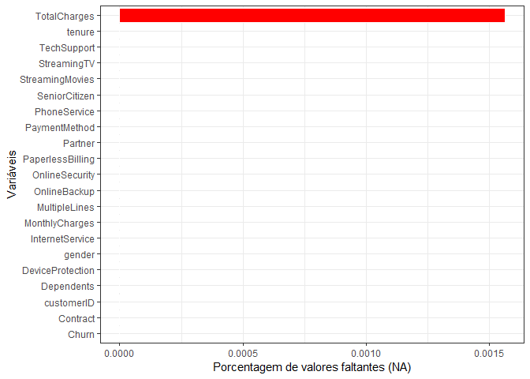
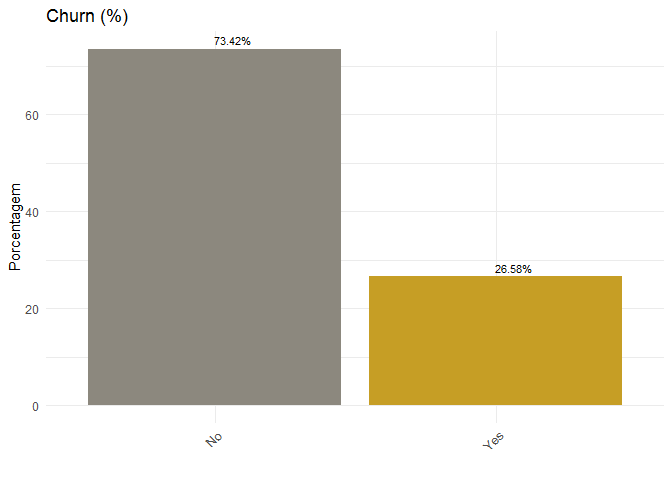
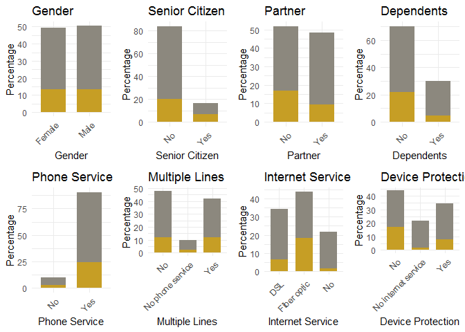
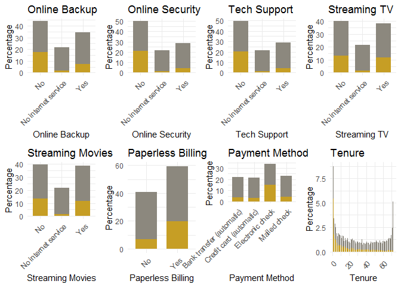
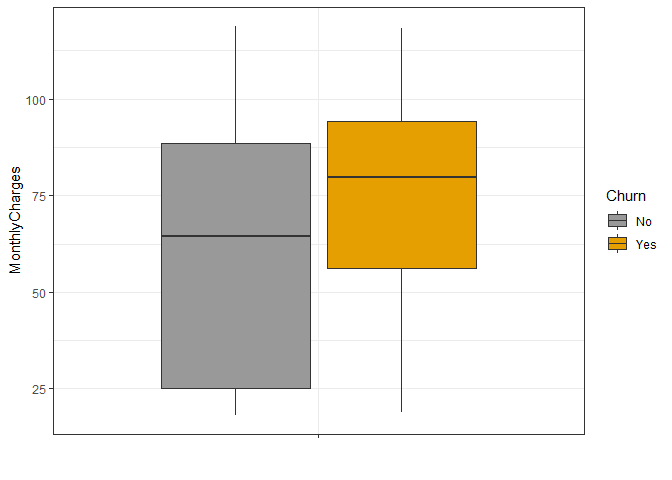
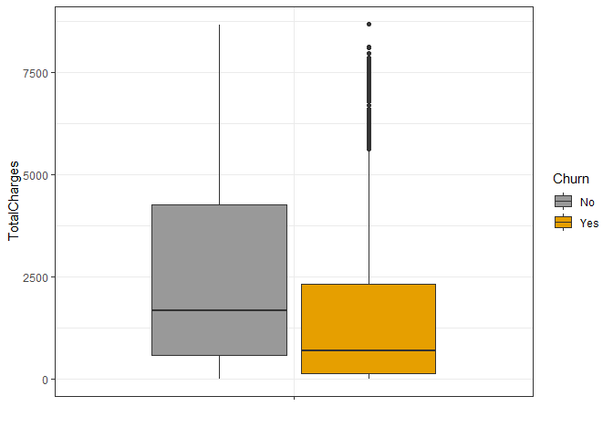
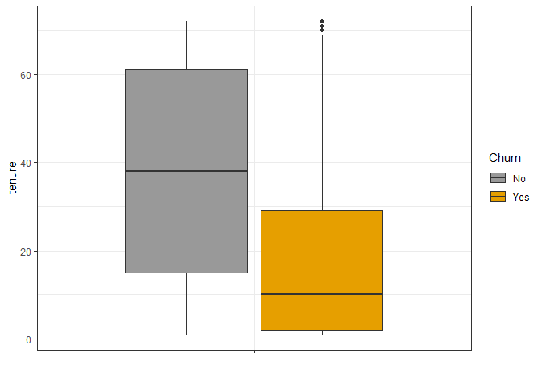
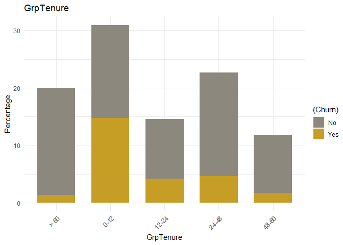

  
  
  
  <!-- highlight: tango pygments kate monochrome zenburn haddock textmate -->
  <!-- theme: cerulean, journal, flatly, readable, spacelab, united, cosmo, lumen, paper, sandston, simplex, yeti -->
  
  <!----------  INÍCIO CONFIG  ---------->
  


  
## Introdução
  
  Essa análise tem como principal foco verificar padrões e coomportamentos em clientes de telecomunicações que possuem maior propenção a deixar de ser cliente da empresa (sair da base / migração de clientes). Através de análise exploratória de dados incia-se um processo de descoberta dos dados e possíveis variáveis que viabilizam o reconhecimento de padrões de clientes de telco e, posteriormente, o uso de técnicas de análise preditiva para determinar os clientes que com maior probabilidade irão migrar.

||
|:---:|
-------------------------------------
  
  
## Banco de Dados

### Descrição
  
  O conjunto de dados utilizado foi o de título *Telco Customer Churn* extraído da plataforma [kaggle](https://www.kaggle.com/). As informações contidas no banco são do programa de retenção de 7044 clientes de telecomunicações contendo 21 variáveis descritas a seguir:
  
- Se deixou de ser cliente
- Serviços aderidos por cada cada cliente mobile  
    + qtd. de linhas  
    + internet  
    + segurança online  
    + backup online  
    + seguro  
    + suporte técnico  
    + TV a cabo  

- Informações da conta do cliente   
    +  Tempo da conta  
    +  Contrato  
    +  Método de pagamento  
    +  Conta online (sem impressão)  
    +  Encargos mensais  
    +  Total da conta  

- Informações Demográficas do cliente  
    + Gênero  
    + Faixa etária  
    + Possui parceiros ou dependentes  

*Os dados em questão são públicos e disponíveis para download clicando [AQUI](https://www.kaggle.com/blastchar/telco-customer-churn/home).* 

### Pacotes

Alguns pacotes R utilizados nessa rotina
```yaml
library(tidyverse)
library(highcharter)
library(cowplot)
library(gridExtra)
library(gridExtra)
library(highcharter)
```

  
### Leitura
Lendo o arquivo de dados

```r
telco = read.csv2("WA_Fn-UseC_-Telco-Customer-Churn.csv", sep = ";", header = TRUE, na.strings = "")
#class(db)
```

### Estrutura

7.043 observações e 21 variáveis.


```r
glimpse(telco) #str(db)
```

```
## Observations: 7,043
## Variables: 21
## $ customerID       <fct> 7590-VHVEG, 5575-GNVDE, 3668-QPYBK, 7795-CFOC...
## $ gender           <fct> Female, Male, Male, Male, Female, Female, Mal...
## $ SeniorCitizen    <int> 0, 0, 0, 0, 0, 0, 0, 0, 0, 0, 0, 0, 0, 0, 0, ...
## $ Partner          <fct> Yes, No, No, No, No, No, No, No, Yes, No, Yes...
## $ Dependents       <fct> No, No, No, No, No, No, Yes, No, No, Yes, Yes...
## $ tenure           <dbl> 1, 34, 2, 45, 2, 8, 22, 10, 28, 62, 13, 16, 5...
## $ PhoneService     <fct> No, Yes, Yes, No, Yes, Yes, Yes, No, Yes, Yes...
## $ MultipleLines    <fct> No phone service, No, No, No phone service, N...
## $ InternetService  <fct> DSL, DSL, DSL, DSL, Fiber optic, Fiber optic,...
## $ OnlineSecurity   <fct> No, Yes, Yes, Yes, No, No, No, Yes, No, Yes, ...
## $ OnlineBackup     <fct> Yes, No, Yes, No, No, No, Yes, No, No, Yes, N...
## $ DeviceProtection <fct> No, Yes, No, Yes, No, Yes, No, No, Yes, No, N...
## $ TechSupport      <fct> No, No, No, Yes, No, No, No, No, Yes, No, No,...
## $ StreamingTV      <fct> No, No, No, No, No, Yes, Yes, No, Yes, No, No...
## $ StreamingMovies  <fct> No, No, No, No, No, Yes, No, No, Yes, No, No,...
## $ Contract         <fct> Month-to-month, One year, Month-to-month, One...
## $ PaperlessBilling <fct> Yes, No, Yes, No, Yes, Yes, Yes, No, Yes, No,...
## $ PaymentMethod    <fct> Electronic check, Mailed check, Mailed check,...
## $ MonthlyCharges   <dbl> 29.85, 56.95, 53.85, 42.30, 70.70, 99.65, 89....
## $ TotalCharges     <dbl> 29.85, 1889.50, 108.15, 1840.75, 151.65, 820....
## $ Churn            <fct> No, No, Yes, No, Yes, Yes, No, No, Yes, No, N...
```

Porcentagem de NA por variável


```r
options(repr.plot.width = 6, repr.plot.height = 4)
missing_data <- telco %>% summarise_all(funs(sum(is.na(.))/n()))
missing_data <- gather(missing_data, key = "variables", value = "percent_missing")
ggplot(missing_data, aes(x = reorder(variables, percent_missing), y = percent_missing)) +
geom_bar(stat = "identity", fill = "red", aes(color = I('white')), size = 0.3)+
xlab('Variáveis')+
ylab('Porcentagem de valores faltantes (NA)') +
coord_flip()+ 
theme_bw()
```

<!-- -->


```r
cat("Existem", sum(is.na(telco$TotalCharges)), "observações faltantes na variável 'TotalCharges'")
```

```
## Existem 11 observações faltantes na variável 'TotalCharges'
```

Entretanto, esses valores faltantes apenas ocorrem quando a variável 'tenure' assume valor zero e consequentemente na variável 'MonthlyCharges' existem valores (diferente de zero). Ou seja, 'TotalCharges' apenas possui valores para meses (tenure) maiores ou iguais a um de permanência do cliente. 


```r
telco[is.na(telco$TotalCharges), c(1, 6, 19, 20)]
```

<div data-pagedtable="false">
  <script data-pagedtable-source type="application/json">
{"columns":[{"label":[""],"name":["_rn_"],"type":[""],"align":["left"]},{"label":["customerID"],"name":[1],"type":["fctr"],"align":["left"]},{"label":["tenure"],"name":[2],"type":["dbl"],"align":["right"]},{"label":["MonthlyCharges"],"name":[3],"type":["dbl"],"align":["right"]},{"label":["TotalCharges"],"name":[4],"type":["dbl"],"align":["right"]}],"data":[{"1":"4472-LVYGI","2":"0","3":"52.55","4":"NA","_rn_":"489"},{"1":"3115-CZMZD","2":"0","3":"20.25","4":"NA","_rn_":"754"},{"1":"5709-LVOEQ","2":"0","3":"80.85","4":"NA","_rn_":"937"},{"1":"4367-NUYAO","2":"0","3":"25.75","4":"NA","_rn_":"1083"},{"1":"1371-DWPAZ","2":"0","3":"56.05","4":"NA","_rn_":"1341"},{"1":"7644-OMVMY","2":"0","3":"19.85","4":"NA","_rn_":"3332"},{"1":"3213-VVOLG","2":"0","3":"25.35","4":"NA","_rn_":"3827"},{"1":"2520-SGTTA","2":"0","3":"20.00","4":"NA","_rn_":"4381"},{"1":"2923-ARZLG","2":"0","3":"19.70","4":"NA","_rn_":"5219"},{"1":"4075-WKNIU","2":"0","3":"73.35","4":"NA","_rn_":"6671"},{"1":"2775-SEFEE","2":"0","3":"61.90","4":"NA","_rn_":"6755"}],"options":{"columns":{"min":{},"max":[10]},"rows":{"min":[10],"max":[10]},"pages":{}}}
  </script>
</div>

Optamos por remover essas observações do banco de dados uma vez que esses clientes não ficaram tempo suficiente (menos de um Mês) para avaliações e análises preditivas posteriores.


```r
telco <- telco[!is.na(telco$TotalCharges),]
telco[is.na(telco$TotalCharges), c(1, 6, 19, 20)]
```

<div data-pagedtable="false">
  <script data-pagedtable-source type="application/json">
{"columns":[{"label":["customerID"],"name":[1],"type":["fctr"],"align":["left"]},{"label":["tenure"],"name":[2],"type":["dbl"],"align":["right"]},{"label":["MonthlyCharges"],"name":[3],"type":["dbl"],"align":["right"]},{"label":["TotalCharges"],"name":[4],"type":["dbl"],"align":["right"]}],"data":[],"options":{"columns":{"min":{},"max":[10]},"rows":{"min":[10],"max":[10]},"pages":{}}}
  </script>
</div>


```r
cat("Portanto, o novo banco de dados possui", dim(telco)[1], "observações.")
```

```
## Portanto, o novo banco de dados possui 7032 observações.
```


<!--
Portanto, esses valores não significam necessariamente valores faltantes, esses podem apenas ser interpretados como clientes que não ficaram tempo suficiente (menos de um mês) para que fossem gerados encargos na variável 'TotalCharges'. A princípio, essas observações não serão excluídas. -->

### Preparação de dados

Existem apenas 3 variáveis contínuas no banco de dados ('Tenure', 'MonthlyCharges' e 'TotalCharges'). 'SeniorCitizen' está em formato de variável inteira (0 ou 1) e este será modificado para categórica (factor).

```r
telco <- telco[complete.cases(telco),]
telco$SeniorCitizen <- ifelse(telco$SeniorCitizen==1, 'Yes', 'No')
```


```r
knitr::kable(sapply(telco, typeof))
```

<table>
 <thead>
  <tr>
   <th style="text-align:left;">   </th>
   <th style="text-align:left;"> x </th>
  </tr>
 </thead>
<tbody>
  <tr>
   <td style="text-align:left;"> customerID </td>
   <td style="text-align:left;"> integer </td>
  </tr>
  <tr>
   <td style="text-align:left;"> gender </td>
   <td style="text-align:left;"> integer </td>
  </tr>
  <tr>
   <td style="text-align:left;"> SeniorCitizen </td>
   <td style="text-align:left;"> character </td>
  </tr>
  <tr>
   <td style="text-align:left;"> Partner </td>
   <td style="text-align:left;"> integer </td>
  </tr>
  <tr>
   <td style="text-align:left;"> Dependents </td>
   <td style="text-align:left;"> integer </td>
  </tr>
  <tr>
   <td style="text-align:left;"> tenure </td>
   <td style="text-align:left;"> double </td>
  </tr>
  <tr>
   <td style="text-align:left;"> PhoneService </td>
   <td style="text-align:left;"> integer </td>
  </tr>
  <tr>
   <td style="text-align:left;"> MultipleLines </td>
   <td style="text-align:left;"> integer </td>
  </tr>
  <tr>
   <td style="text-align:left;"> InternetService </td>
   <td style="text-align:left;"> integer </td>
  </tr>
  <tr>
   <td style="text-align:left;"> OnlineSecurity </td>
   <td style="text-align:left;"> integer </td>
  </tr>
  <tr>
   <td style="text-align:left;"> OnlineBackup </td>
   <td style="text-align:left;"> integer </td>
  </tr>
  <tr>
   <td style="text-align:left;"> DeviceProtection </td>
   <td style="text-align:left;"> integer </td>
  </tr>
  <tr>
   <td style="text-align:left;"> TechSupport </td>
   <td style="text-align:left;"> integer </td>
  </tr>
  <tr>
   <td style="text-align:left;"> StreamingTV </td>
   <td style="text-align:left;"> integer </td>
  </tr>
  <tr>
   <td style="text-align:left;"> StreamingMovies </td>
   <td style="text-align:left;"> integer </td>
  </tr>
  <tr>
   <td style="text-align:left;"> Contract </td>
   <td style="text-align:left;"> integer </td>
  </tr>
  <tr>
   <td style="text-align:left;"> PaperlessBilling </td>
   <td style="text-align:left;"> integer </td>
  </tr>
  <tr>
   <td style="text-align:left;"> PaymentMethod </td>
   <td style="text-align:left;"> integer </td>
  </tr>
  <tr>
   <td style="text-align:left;"> MonthlyCharges </td>
   <td style="text-align:left;"> double </td>
  </tr>
  <tr>
   <td style="text-align:left;"> TotalCharges </td>
   <td style="text-align:left;"> double </td>
  </tr>
  <tr>
   <td style="text-align:left;"> Churn </td>
   <td style="text-align:left;"> integer </td>
  </tr>
</tbody>
</table>


## Análise Exploratória


```r
glimpse(telco)
```

```
## Observations: 7,032
## Variables: 21
## $ customerID       <fct> 7590-VHVEG, 5575-GNVDE, 3668-QPYBK, 7795-CFOC...
## $ gender           <fct> Female, Male, Male, Male, Female, Female, Mal...
## $ SeniorCitizen    <chr> "No", "No", "No", "No", "No", "No", "No", "No...
## $ Partner          <fct> Yes, No, No, No, No, No, No, No, Yes, No, Yes...
## $ Dependents       <fct> No, No, No, No, No, No, Yes, No, No, Yes, Yes...
## $ tenure           <dbl> 1, 34, 2, 45, 2, 8, 22, 10, 28, 62, 13, 16, 5...
## $ PhoneService     <fct> No, Yes, Yes, No, Yes, Yes, Yes, No, Yes, Yes...
## $ MultipleLines    <fct> No phone service, No, No, No phone service, N...
## $ InternetService  <fct> DSL, DSL, DSL, DSL, Fiber optic, Fiber optic,...
## $ OnlineSecurity   <fct> No, Yes, Yes, Yes, No, No, No, Yes, No, Yes, ...
## $ OnlineBackup     <fct> Yes, No, Yes, No, No, No, Yes, No, No, Yes, N...
## $ DeviceProtection <fct> No, Yes, No, Yes, No, Yes, No, No, Yes, No, N...
## $ TechSupport      <fct> No, No, No, Yes, No, No, No, No, Yes, No, No,...
## $ StreamingTV      <fct> No, No, No, No, No, Yes, Yes, No, Yes, No, No...
## $ StreamingMovies  <fct> No, No, No, No, No, Yes, No, No, Yes, No, No,...
## $ Contract         <fct> Month-to-month, One year, Month-to-month, One...
## $ PaperlessBilling <fct> Yes, No, Yes, No, Yes, Yes, Yes, No, Yes, No,...
## $ PaymentMethod    <fct> Electronic check, Mailed check, Mailed check,...
## $ MonthlyCharges   <dbl> 29.85, 56.95, 53.85, 42.30, 70.70, 99.65, 89....
## $ TotalCharges     <dbl> 29.85, 1889.50, 108.15, 1840.75, 151.65, 820....
## $ Churn            <fct> No, No, Yes, No, Yes, Yes, No, No, Yes, No, N...
```
Todos os gráficos a seguir utilizarão legenda em comum a seguir.
||


Visualizando, primeiramente, a variável categórica resposta de interesse 'Churn'. Onde `Yes` significa que o cliente migrou (deixou de ser cliente) e `No` que ele permanece como cliente.

Mais especificamente, pelo 'Churn' fica claro o quantitativo de clientes que migraram no último mes. 
Cerca de 26% dos clientes deixaram de ser atendido pelos serviços da empresa no último mes.


```r
options(repr.plot.width = 6, repr.plot.height = 4)
telco %>% 
group_by(Churn) %>% 
summarise(Count = n())%>% 
mutate(percent = prop.table(Count)*100)%>%
ggplot(aes(reorder(Churn, -percent), percent), fill = Churn)+
geom_col(fill = c("#8c887e", "#c69e25"))+
geom_text(aes(label = sprintf("%.2f%%", percent)), hjust = 0.01,vjust = -0.5, size =3)+ theme_minimal() +
theme(legend.position="right", axis.text.x = element_text(angle = 45, hjust = 1))+  
xlab("") + 
ylab("Porcentagem")+
ggtitle("Churn (%)")
```

<!-- -->

- Gênero - A porcentagem de churn é praticamente a mesma entre gêneros masculino e feminino.
- A porcentagem de churn é maior entre os cidadãos de terceira idade (senior citizens)
- Clientes com parceiros e dependentes têm menores taxas de Churn comparadas àquele que não tem parceiros e dependentes.
- Taxa de Churn em clientes que aderiram serviços de Internet de Fibra ótica  são maiores que em outros serviços ou não serviço de internet.
- CLientes que não consumiram serviços como *OnlineSecurity* , *OnlineBackup* e *TechSupport* deixaram a companhia em maior frequência, uma vez comparado com os clientes que consumiram algum tipo desses serviços.


```r
# Plot 1.1 by gender 
p1.1 <- plotuni(telco, telco$gender, "Gender")                 
# plot 1.2 by Senior Citizen
p1.2 <- plotuni(telco, telco$SeniorCitizen, "Senior Citizen")
# plot 1.3 by Partner
p1.3 <- plotuni(telco, telco$Partner, "Partner")
# plot 1.4 by Dependents
p1.4 <- plotuni(telco, telco$Dependents, "Dependents")
# plot 1.5 by Phone Service
p1.5 <- plotuni(telco, telco$PhoneService, "Phone Service")
# plot 1.6 by Multiple Lines
p1.6 <- plotuni(telco, telco$MultipleLines, "Multiple Lines")
# plot 1.7 by Internet Service
p1.7 <- plotuni(telco, telco$InternetService, "Internet Service")
# plot 1.8 by DeviceProtection
p1.8 <- plotuni(telco, telco$DeviceProtection, "Device Protection")

# draw the plot grid
grid.arrange(p1.1, p1.2, p1.3, p1.4, p1.5, p1.6, p1.7, p1.8, ncol=4)
```

<!-- -->


```r
# Plot 2.1 by OnlineBackup 
p2.1 <- plotuni(telco, telco$OnlineBackup, "Online Backup")     
# plot 2.2 by Online Security
p2.2 <- plotuni(telco, telco$OnlineSecurity, "Online Security")
# plot 2.3 by TechSupport
p2.3 <- plotuni(telco, telco$TechSupport, "Tech Support")
# plot 2.4 by StreamingTV
p2.4 <- plotuni(telco, telco$StreamingTV, "Streaming TV")
# plot 2.5 by StreamingMovies
p2.5 <- plotuni(telco, telco$StreamingMovies, "Streaming Movies")
# plot 2.6 by PaperlessBilling
p2.6 <- plotuni(telco, telco$PaperlessBilling, "Paperless Billing")
# plot 2.7 by PaymentMethod
p2.7 <- plotuni(telco, telco$PaymentMethod, "Payment Method")
# plot 2.8 by Tenure
p2.8 <- plotuni(telco, telco$tenure, "Tenure")

# draw the plot grid
grid.arrange(p2.1, p2.2, p2.3, p2.4, p2.5, p2.6, p2.7, p2.8, ncol=4)
```

<!-- -->


- Clientes com pelo menos um ou dois anos de contrato têm menores taxas de Churn que clientes que ficaram períodos inferiores a um ano.
- A frequência de churn em clientes que recebiam fatura impressa (Paperless Billing) é maior que em clientes que não aderiram esse serviço.
- Clientes com método de pagamento (PaymentMethod) *ElectronicCheck* apresentaram maiores taxas de desistência da companhia.


Vamos analisar, agora, as três únicas variáveis contínuas no banco versus CHURN:

MonthlyCharges: os clientes que migraram tiveram encargos mensais altos comparado aos que não migrram, com uma mediana superior a 75.


```r
ggplot(telco, aes(y= MonthlyCharges, x = "", fill = Churn)) + 
geom_boxplot() + theme_bw()+ scale_fill_manual(values=c("#999999", "#E69F00")) +
xlab(" ")
```

<!-- -->


TotalCharges: A mediana dos encargos totais dos clientes que optaram por deixar a companhia é inferior à mediana dos que ainda permaneceram como clientes, mas, novamente, com presença de outliers.


```r
ggplot(telco, aes(y= TotalCharges, x = "", fill = Churn)) + 
geom_boxplot() + theme_bw()+ scale_fill_manual(values=c("#999999", "#E69F00")) +
xlab(" ")
```

<!-- -->

Tenure: Entre os clientes que migraram a mediana é aproximadamente igual a 10 meses, existem alguns possíveis outliers neste.


```r
options(repr.plot.width =6, repr.plot.height = 2)
ggplot(telco, aes(y= tenure, x = "", fill = Churn)) + 
geom_boxplot() + theme_bw()+ scale_fill_manual(values=c("#999999", "#E69F00")) +
xlab(" ")
```

<!-- -->


```r
paste("Conhecendo que o valor mínimo de tenure: ",min(telco$tenure)," e o valor máximo: ",max(telco$tenure), "sugerimos criar uma variável por classes.")
```

```
## [1] "Conhecendo que o valor mínimo de tenure:  1  e o valor máximo:  72 sugerimos criar uma variável por classes."
```


Iremos criar, então, uma nova variável intervalar com os seguintes grupos:

- 0-12[  
- [12-24[  
- [24-48[  
- [48-60[  
- [60-Inf[  

Criando a função que define os grupos intervalares

```r
# create the goupping function with the define intervals
CreateGrp <- function(tn){
    if (tn >= 0 & tn <= 12){
        return('0-12')
    }else if(tn > 12 & tn <= 24){
        return('12-24')
    }else if (tn > 24 & tn <= 48){
        return('24-48')
    }else if (tn > 48 & tn <=60){
        return('48-60')
    }else if (tn > 60){
        return('> 60')
    }
}
# apply the Group function to the tenure column
telco$GrpTenure <- sapply(telco$tenure,CreateGrp)
# set as factor the new column
telco$GrpTenure <- as.factor(telco$GrpTenure)
```


```r
knitr::kable(sapply(telco, typeof))
```

<table>
 <thead>
  <tr>
   <th style="text-align:left;">   </th>
   <th style="text-align:left;"> x </th>
  </tr>
 </thead>
<tbody>
  <tr>
   <td style="text-align:left;"> customerID </td>
   <td style="text-align:left;"> integer </td>
  </tr>
  <tr>
   <td style="text-align:left;"> gender </td>
   <td style="text-align:left;"> integer </td>
  </tr>
  <tr>
   <td style="text-align:left;"> SeniorCitizen </td>
   <td style="text-align:left;"> character </td>
  </tr>
  <tr>
   <td style="text-align:left;"> Partner </td>
   <td style="text-align:left;"> integer </td>
  </tr>
  <tr>
   <td style="text-align:left;"> Dependents </td>
   <td style="text-align:left;"> integer </td>
  </tr>
  <tr>
   <td style="text-align:left;"> tenure </td>
   <td style="text-align:left;"> double </td>
  </tr>
  <tr>
   <td style="text-align:left;"> PhoneService </td>
   <td style="text-align:left;"> integer </td>
  </tr>
  <tr>
   <td style="text-align:left;"> MultipleLines </td>
   <td style="text-align:left;"> integer </td>
  </tr>
  <tr>
   <td style="text-align:left;"> InternetService </td>
   <td style="text-align:left;"> integer </td>
  </tr>
  <tr>
   <td style="text-align:left;"> OnlineSecurity </td>
   <td style="text-align:left;"> integer </td>
  </tr>
  <tr>
   <td style="text-align:left;"> OnlineBackup </td>
   <td style="text-align:left;"> integer </td>
  </tr>
  <tr>
   <td style="text-align:left;"> DeviceProtection </td>
   <td style="text-align:left;"> integer </td>
  </tr>
  <tr>
   <td style="text-align:left;"> TechSupport </td>
   <td style="text-align:left;"> integer </td>
  </tr>
  <tr>
   <td style="text-align:left;"> StreamingTV </td>
   <td style="text-align:left;"> integer </td>
  </tr>
  <tr>
   <td style="text-align:left;"> StreamingMovies </td>
   <td style="text-align:left;"> integer </td>
  </tr>
  <tr>
   <td style="text-align:left;"> Contract </td>
   <td style="text-align:left;"> integer </td>
  </tr>
  <tr>
   <td style="text-align:left;"> PaperlessBilling </td>
   <td style="text-align:left;"> integer </td>
  </tr>
  <tr>
   <td style="text-align:left;"> PaymentMethod </td>
   <td style="text-align:left;"> integer </td>
  </tr>
  <tr>
   <td style="text-align:left;"> MonthlyCharges </td>
   <td style="text-align:left;"> double </td>
  </tr>
  <tr>
   <td style="text-align:left;"> TotalCharges </td>
   <td style="text-align:left;"> double </td>
  </tr>
  <tr>
   <td style="text-align:left;"> Churn </td>
   <td style="text-align:left;"> integer </td>
  </tr>
  <tr>
   <td style="text-align:left;"> GrpTenure </td>
   <td style="text-align:left;"> integer </td>
  </tr>
</tbody>
</table>


Então, a distribuição da nova variável *GrpTenure* por Churn


```r
# Plot 3.1 by GrpTenure
p3.1 <- plotuni(telco, telco$GrpTenure, "GrpTenure")                 
# draw the plot grid
ggarrange(p3.1, ncol=1, legend = "right", common.legend = TRUE)
```

<!-- -->

